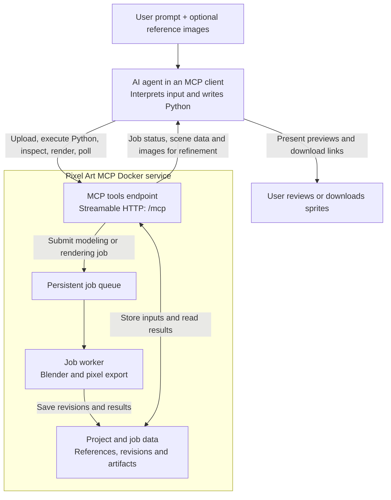
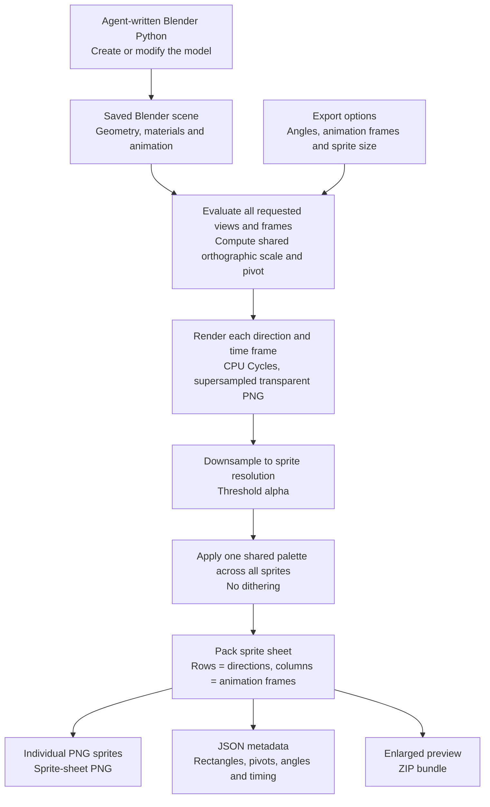

# From prompts to sprite sheets

## What we are trying to achieve

Pixel Art MCP lets a person describe an object to an AI agent and iteratively turn that description
into a usable pixel-art sprite sheet. Optional uploaded photographs or drawings help the agent
match a real object's shape, proportions, and colors. The result should support both rotation
views and animation, without requiring the person to manually model and render every sprite.

For example:

> Create a stylized wooden chair resembling this photo. Make its backrest taller, add a gentle
> rocking animation, and export transparent 64x64 sprites at 0, 45, and 90 degrees for eight frames.

The intended journey is to describe, preview, refine, and export. The agent builds an editable
Blender scene, examines rendered previews, and modifies the same model until the user is satisfied.
An export can contain a single static sprite, multiple directions, animation frames, or the
combination of directions and animation. PNG sprites and a packed sheet are accompanied by JSON
metadata describing frame rectangles, pivots, directions, and playback timing, plus a ZIP download.

## Why use Blender?

A 3D model provides one consistent source for every view. To show a chair from 0°, 45°, and 90°,
the renderer moves an orthographic camera around that model; it does not rotate a flat image or
ask the AI to independently redraw each direction. Geometry and materials remain shared, and
features hidden in one view can become visible in another.

Animation adds a time dimension to the same scene. The agent can keyframe location, rotation, and
scale using Blender Python. The renderer samples those frames from each requested direction.
This makes a material or shape edit apply across the whole export, instead of requiring separate
edits to every sprite. The current workflow targets stylized objects and simple transform animation;
it does not promise automatic or exact 3D reconstruction from a photograph.

## MCP integration: the agent creates and modifies the model

MCP (Model Context Protocol) exposes the service's operations as tools to an AI client. The AI
lives in that client, not in the Docker service. It interprets the prompt and reference images,
writes Blender Python, and calls `execute_blender_python` to create or modify geometry, materials,
and keyframes. The server executes that code and saves a new `.blend` revision on success.

The agent uses `create_project` and `add_reference_image` to prepare the workspace, then
`get_reference_image` to examine the uploaded image. Local files can alternatively be uploaded
through the HTTP multipart endpoint. Modeling and rendering return job IDs immediately; the
agent polls `get_job`, checks whether the job succeeded, and uses `inspect_scene` or `get_artifact`
to examine the result before making another edit. `render_preview` supports quick visual feedback;
`render_sprites` produces the final directional or animated export.

The longer-term integration goal includes ChatGPT acting as the MCP client. The current release
is local-only: a remotely hosted client cannot reach this service's localhost address directly.
Remote deployment and authentication are not implemented yet. See [client setup](client-setup.md)
for the supported connection and upload workflow.

## Rendering pipeline: one scene, many directions and frames

After the agent creates or edits a model, rendering starts from a saved scene revision. The export
does not modify that revision. The renderer computes shared framing across all requested views
and time samples, then renders each direction/frame combination and converts the results to pixels.

By default, the service renders at four times the target resolution, downsamples to 16×16 pixels,
uses transparency and a shared 32-color palette, and exports four cardinal directions at 5 fps.
Tile counts select small (16×16), tall (16×32, 16×48), wide (32×16), or larger canvases; explicit
pixel dimensions override tile sizing, including non-multiples of 16.
Animation is opt-in through a frame range; a static export uses one time sample. A supplied custom
palette can replace automatic palette fitting.

The optional pixel-agents package exports the application's existing furniture manifest and PNG
structure without changing its code. Its fixed 5 fps and agent-activated off/on animation rules
are reflected in the tool schema and validation. The offline HTML preview compares the actual
low-resolution sprites with higher-resolution source renders and highlights the resolution used
by pixel-agents. Floor footprints remain separate from sprite canvas dimensions.

Rotation and animation are independent dimensions. Three directions and eight animation frames
produce 24 sprites: a sheet with three rows and eight columns. At 64x64 pixels per sprite, that
sheet is 512x192 pixels. Shared scale and pivot keep placement consistent while retaining motion
such as rocking or bobbing; the renderer does not recenter each frame independently.

See [tool usage](tools.md) for concrete modeling and export calls, and [architecture](architecture.md)
for revision consistency, storage, execution limits, and component responsibilities.
