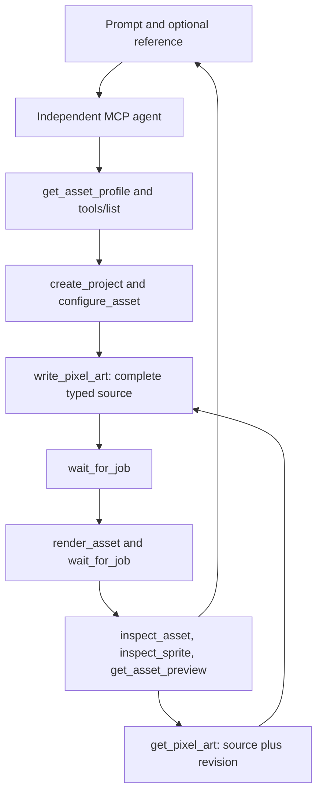
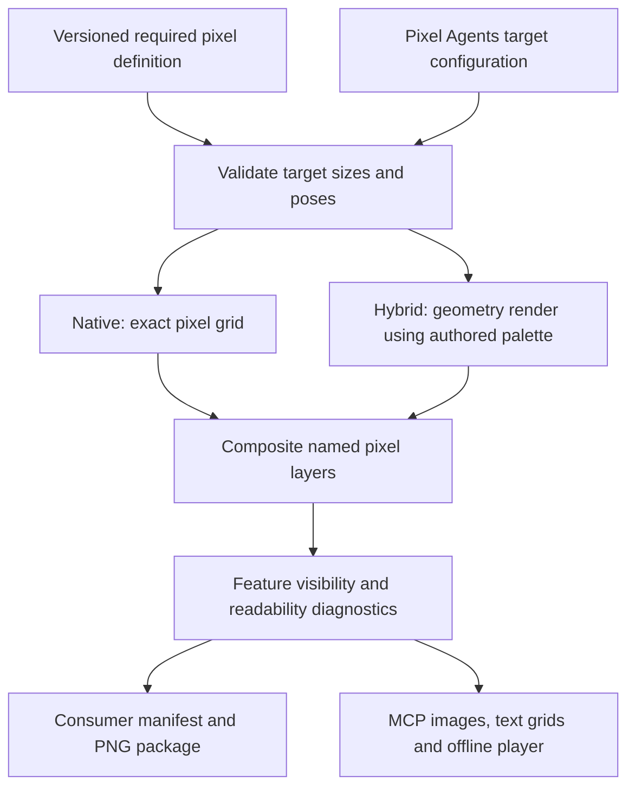

# Pixel Agents assets from MCP

Pixel Art MCP lets an independent agent create, inspect and refine Pixel Agents furniture,
characters and pets at the consumer's native pixel density. Optional reference images guide
shape and palette. Identifying features are designed on the final grid, not recovered by shrinking
a detailed model or adding colors.

For example:

> Create a wooden rain barrel at 16x32. Make its faucet and water gauge distinct connected shapes,
> keep a separating wood gap, and animate rain above the body. Inspect all views in context.

The AI lives in the MCP client. The server does not call an image-generation API. An agent needs
only the tools it discovers from this server: no source checkout, hidden imports, shell or browser.

## Discovery and authoring

`get_asset_profile` provides exact canvases, consumer pose semantics, design rules, a complete
typed JSON starter, and executable tool-call examples. `write_pixel_art` exposes the entire
versioned schema and invokes mandatory `Canvas`/`PixelArt` helpers on the server.
Each successful write saves source in a new Blender revision.

Edits are complete replacements guarded by an expected revision. Failed or stale edits preserve
the current revision. Both text-only and vision-capable agents can inspect their results entirely
through MCP. PNG, JSON and bounded source text are returned inline; installable ZIPs are available
for the human consumer.

## Native and hybrid rendering

Native mode paints exact pixels from named ordered per-view/per-frame layers. Static defaults
are reused; exact frame patches override them. The palette is fixed for the whole asset. Native
pixels are never antialiased, dithered, supersampled or requantized.

Hybrid mode optionally supplies broad Blender geometry under required pixel layers. The advanced
`execute_blender_python` tool prepares that geometry. Anchored patches follow projected object
origins, but are screen-space overlays, not depth-tested decals or automatic multi-view redraws.

The goal is legibility at existing resolution. A faucet may need a 10-pixel glyph instead of a
physically accurate mesh. Texture and minor hardware yield space to identifying features.
Diagnostics measure visibility and connectivity, not whether a viewer recognizes the object.
Every export requires visual review; contextual previews are explicitly approximate.
A development-only harness checks packages in a read-only copy of the real consumer.

See [tool usage](tools.md), [target profiles](game-assets.md), and
[architecture](architecture.md) for the complete contract and execution boundaries.
