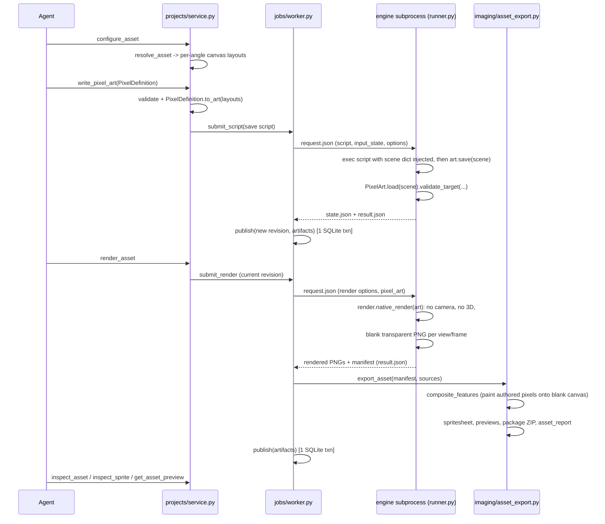

# Rendering pipeline

This describes how a `write_pixel_art` call turns into published PNG/ZIP artifacts: the
process boundary between the application process and the script/render engine subprocess, and
what compositing does today. For the MCP-agent-facing workflow and contract, see
[overview](overview.md); for consistency/transaction guarantees, see
[architecture](architecture.md).

## End-to-end flow

Only one step ever runs a submitted script or builds render output: the subprocess spawned in
step 3 (`engine/runner.py`, run with the app's own Python interpreter — no external renderer).
Everything else, including all pixel compositing, is application Python (Pillow/stdlib).

The only data that crosses the engine process boundary is `request.json` (script/render options,
`input_state`, reference images) in and `result.json` (scene summary or render manifest) out —
the application process and the engine subprocess never share memory, only this JSON handoff
(`docs/architecture.md`).

## Native rendering (`engine/render.py`)

Every asset renders through `render.native_render`: no camera, no 3D scene, and no resampling
filter. The engine's own "render" step for an asset is an empty transparent image per
view/frame; every visible pixel comes from `imaging/features.py`'s `composite_features` painting
the authored patches directly onto that blank canvas (`image.putpixel(...)` with the exact
`#RRGGBB` from the palette). `execute_pixel_script` can still run arbitrary Python for scripting
convenience (e.g. computing a `PixelArt` definition with a loop instead of a static JSON
payload — see `examples/chair.py`), but only the saved `pixel_art` definition is ever exported.

## Job/worker/revision model

A single worker claims one job at a time. Only `"script"` jobs (from `write_pixel_art` or
`execute_pixel_script`) create a new scene revision; render jobs reuse the current revision
and only produce new artifacts. Publication — the new revision pointer (if any), artifacts, and
job state — happens in one SQLite transaction after files move into persistent storage, so a
failed or cancelled job never leaves partial output visible. See [architecture](architecture.md)
for the full consistency and concurrency guarantees this relies on.
