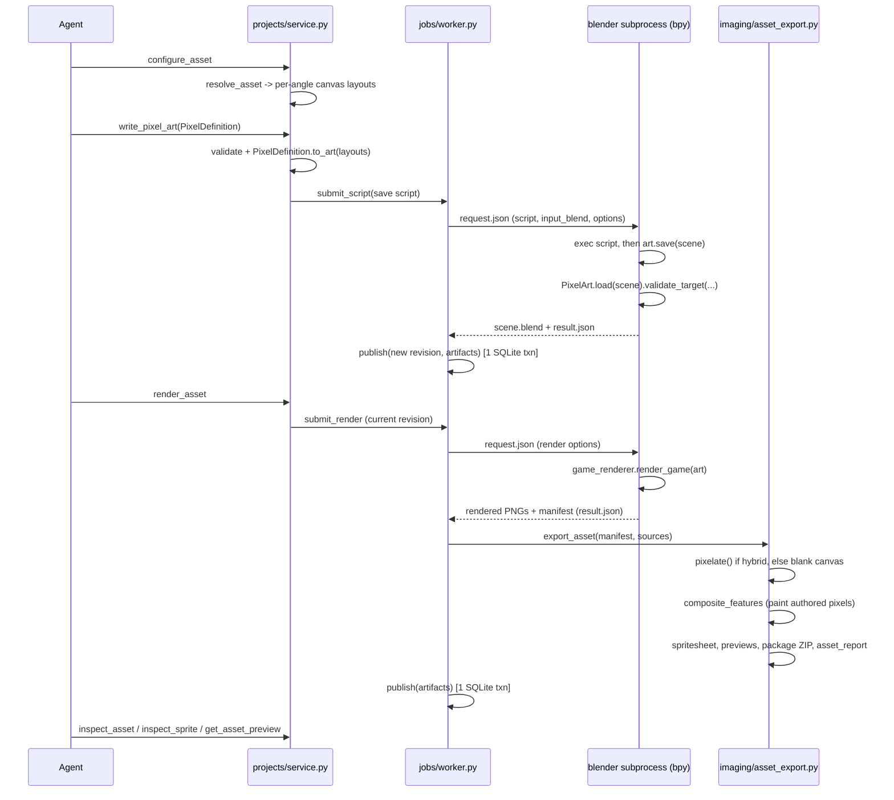
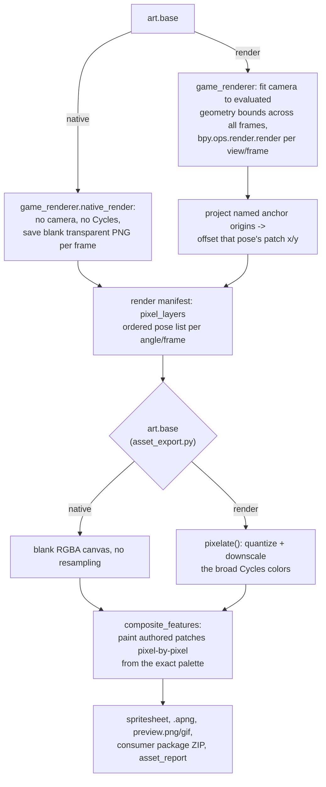
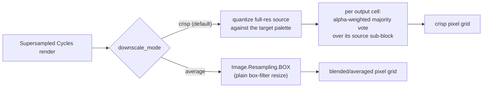

# Rendering pipeline

This describes how a `write_pixel_art` call turns into published PNG/ZIP artifacts: the
process boundary between application Python and Blender's bundled Python, the native/hybrid
render split, and what compositing does today now that downscaling is a from-scratch
implementation rather than a vendored library. For the MCP-agent-facing workflow and contract,
see [overview](overview.md); for consistency/transaction guarantees, see
[architecture](architecture.md).

## End-to-end flow

Only one step ever runs Blender's `bpy`: the subprocess spawned in step 3. Everything else,
including all pixel compositing, is application Python (Pillow/stdlib).

The only data that crosses the `bpy` process boundary is `request.json` (script/render options,
`input_blend`, reference images) in and `result.json` (scene summary or render manifest) out —
the application process never imports `bpy` (`docs/architecture.md`).

## Native vs. hybrid: one flag, two branch points

`PixelDefinition.base` (`Literal["native", "render"]`, set by the agent in `authoring.py`) is
checked at two separate points that must agree, and both converge back on the same pixel-painting
step:

Native mode never touches Cycles or any resampling filter: the "render" Blender does for a native
asset is an empty image, and every visible pixel comes from `composite_features` painting the
authored patches directly (`image.putpixel(...)` with the exact `#RRGGBB` from the palette).
Hybrid mode adds one more step before that: its broad, correctly-lit Cycles colors are downscaled
and quantized by `pixelate()` first, then the same authored patches are painted on top — so
identifying detail is still never resampled, only the broad geometry underneath it is.

## Downscaling (`imaging/pixels.py`)

Hybrid mode's Cycles output is rendered supersampled and needs to come down to the target pixel
grid. This used to call into the vendored `pixel-art-fixer` submodule's `two_stage_pack`; that
submodule has been removed and `pixelate()` is now a self-contained reimplementation of the same
idea, selected by `downscale_mode`:

`crisp` keeps edges and flat regions intact instead of mixing them into a blurred average; legacy
`average` mode exists to reproduce a plain box resize. Alpha is always downscaled separately with
a plain `BOX` resize regardless of mode. Neither path depends on an external library or a vendored
submodule — both are plain Pillow/stdlib operations local to this repo.

## Job/worker/revision model

A single worker claims one job at a time. Only `"script"` jobs (from `write_pixel_art`) create a
new Blender revision; render jobs reuse the current revision and only produce new artifacts.
Publication — the new revision pointer (if any), artifacts, and job state — happens in one SQLite
transaction after files move into persistent storage, so a failed or cancelled job never leaves
partial output visible. See [architecture](architecture.md) for the full consistency and
concurrency guarantees this relies on.
